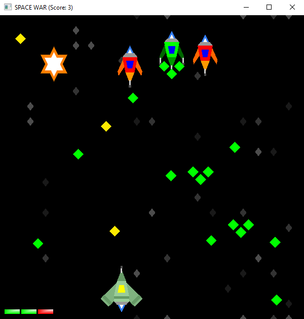
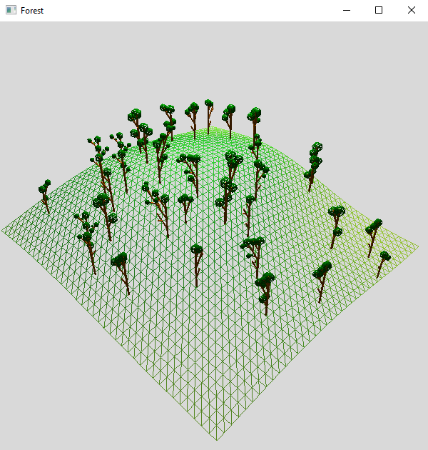
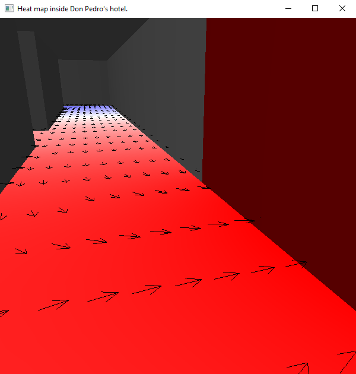

# Modelación y Computación Gráfica 2020
Repositorio de proyectos de modelación y computación gráfica, realizados bajo un curso impartido por la Universidad de Chile, durante el semestre de otoño 2020.

Todos los proyectos contienen un reporte de documentación con instrucciones de ejecución y un resumen de su funcionamiento. Además, cada uno incluye un video que muestra el proyecto en ejecución.

## Space-war
Juego similar a Space Invaders, el usuario controla una nave que se enfrenta a oleadas cada vez más difíciles de naves enemigas. El objetivo es destruir todas las naves enemigas antes de perder 3 vidas. Todos los gráficos, salvo los mensajes de texto, han sido realizados con OpenGl mediante la librería GLFW.

## Generador-bosque-3D
Generador de árboles y bosques en 3D, el usuario puede ejecutar el programa con diferentes parámetros para generar distintos modelos. Una vez ejecutado, el programa permite visualizar su creación mientras se crea un archivo .OBJ local que guarda el modelo 3D. La generación de ambos involucra fractales y números aleatorios.

## Visualizador-laplace-3D
Solucionador y visualizador de ecuaciones de Laplace en 2D con una estructura determinada. El programa debe ser ejecutado con un archivo *json que contenga el problema, a continuación es posible resolverlo y visualizarlo en un ambiente 3D. Dentro de este último, el usuario puede moverse y activar la visualización de las flechas de gradiente y curvas de nivel.

